# An application that search for information from a JSON file

The application consists of:

<b>First part

- search for all folders

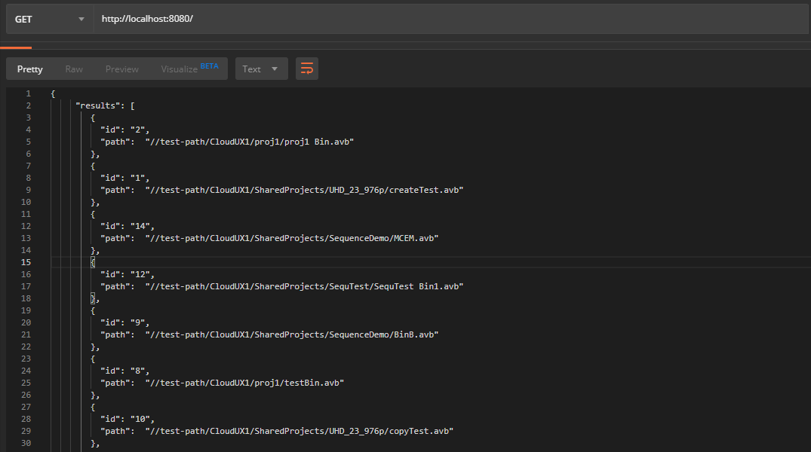

- search all elements by letters query

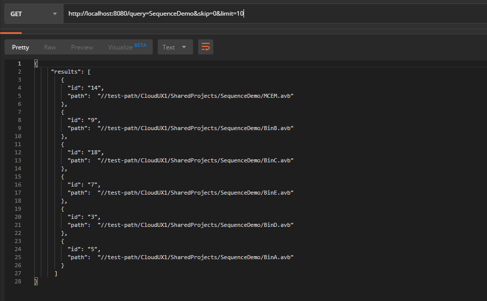

- search all elements by letters query (skip and limit)

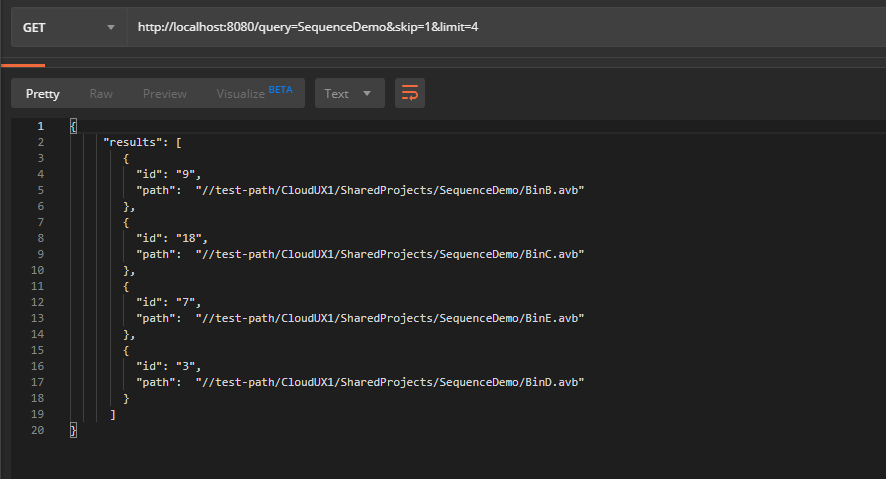

- search all elements by numeric query

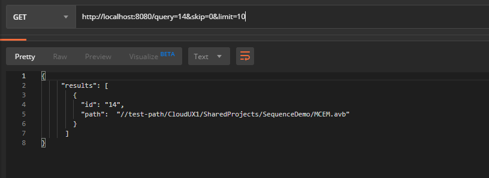

-no results find letters query

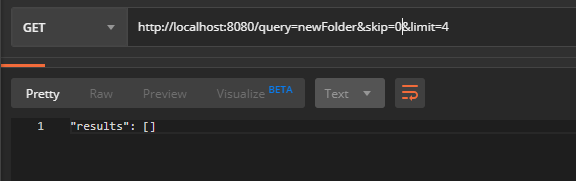

<b>Second part

-search base by content with limit

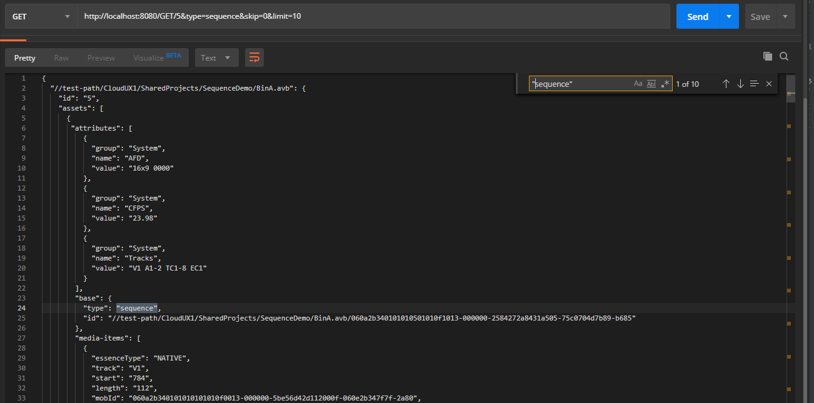

-search base by content with skip and limit

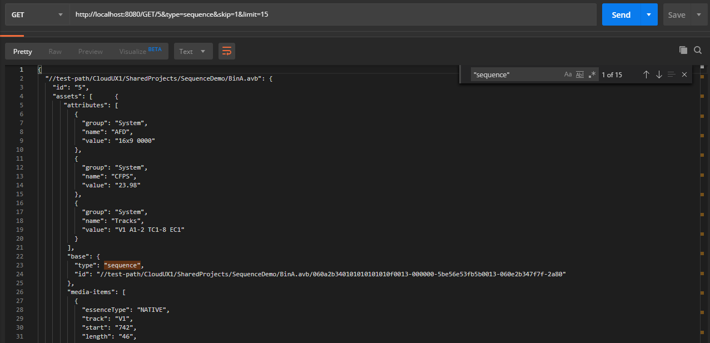

-search base with wrong id folder

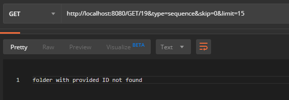

-search base and no found type 

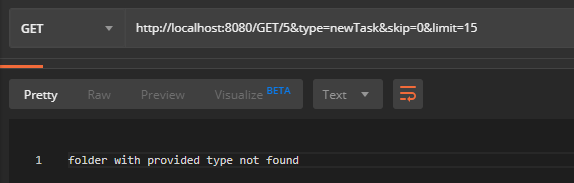

<b>Third part(it was done by accident (at first I misunderstood the content but decided to leave it)

-additional search by elements with brackets

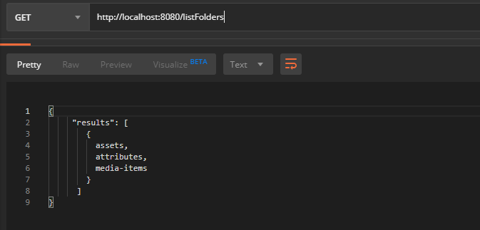

-additional search by elements with skip and limit

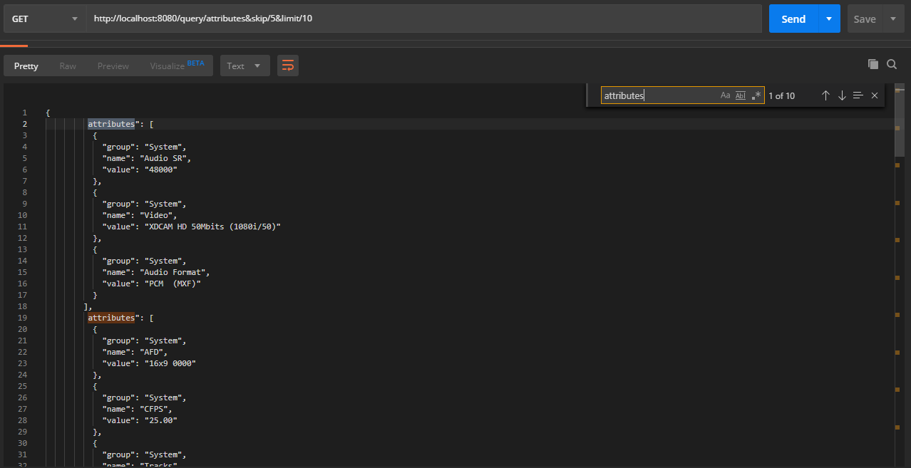

<b> Log info

-logs Info

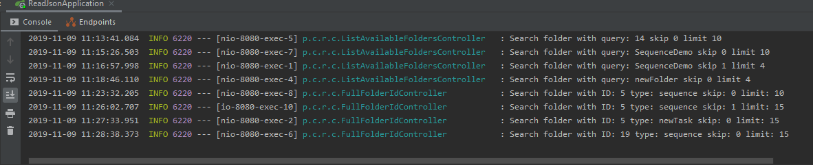

